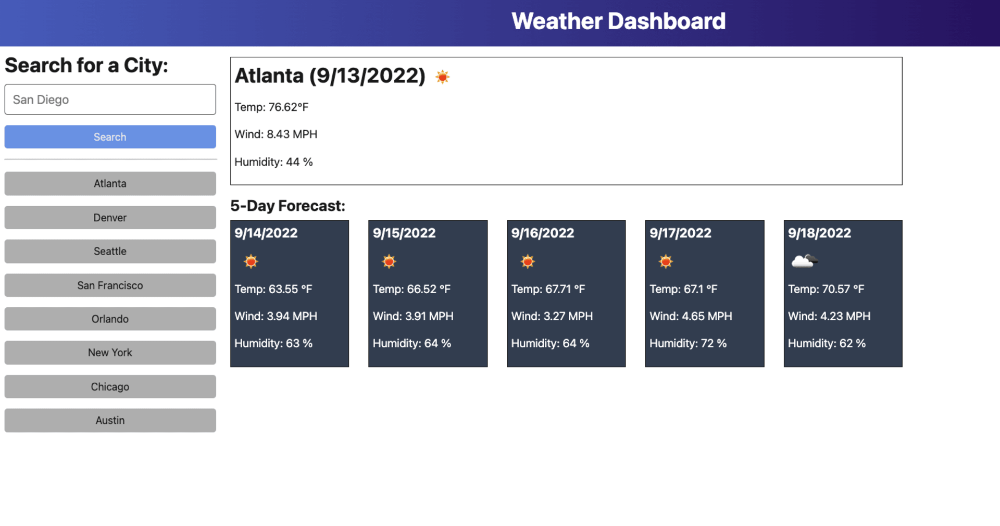

# Weather Dashboard

## TO DO
✅ Get API Key
* Construct API query URL ref: https://openweathermap.org/forecast5   
* Use local storage to store persistent data ref: https://coding-boot-camp.github.io/full-stack/apis/how-to-use-api-keys
* Add a form input
* Search bar for city
* Include city name, the date, icon of weather, temp, humidity, and wind speed
* view future weather 
* 5-day forecast displaying: date, icon of weather, temp, wind speed, adn humidity 
* Include search history that shows data already searched 
* STYLE! 

## Acceptance Criteria
GIVEN a weather dashboard with form inputs  

WHEN I search for a city 
and that city is added to the search history 

WHEN I view current weather conditions for that city 

THEN I am presented with the city name, the date, an icon representation of weather conditions, the temperature, the humidity, and the the wind speed 

WHEN I view future weather conditions for that city 

THEN I am presented with a 5-day forecast that displays the date, an icon representation of weather conditions, the temperature, the wind speed, and the humidity 

WHEN I click on a city in the search history 

THEN I am again presented with current and future conditions for that city

## Mock-Up EXAMPLE

